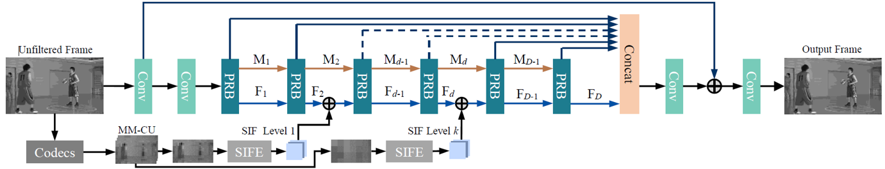

# Progressive Rethinking Network

PARTITION TREE GUIDED PROGRESSIVE RETHINKING NETWORK FOR IN-LOOP FILTERING OF HEVC [ICIP 2019]

Dezhao Wang, Sifeng Xia, Wenhan Yang, Yueyu Hu, Jiaying Liu\*

Institute of Computer Science and Technology, Peking University, Beijing, China

## Method Review

### Progressive Rethinking Block

* Based on Residual Dense Block [1], an inter-block connection is added to preserve the information from previous block.

### Multi-scale Mean value of Coding Unit (MM-CU)

#### Generation

* Generate multi-scale mean value of CU from coarse to fine.

#### Fusion

* Element-wisely add the feature map of each M-CU to different depths of the main branch of PRN.
* Finer M-CU to shallower position.

### Progressive Rethinking Network

## Experimental Results

### Ablation Study

| CLASS       | RDN [1] |  PRN   |  PRN + M   |
| ----------- | :-----: | :----: | :--------: |
| CLASS **B** |  -5.7%  | -6.0%  | **-6.6%**  |
| CLASS **C** |  -9.7%  | -10.1% | **-10.7%** |
| CLASS **D** |  -8.9%  | -9.2%  | **-9.6%**  |
| CLASS **E** | -12.0%  | -12.5% | **-13.3%** |
| Average     |  -8.7%  | -9.1%  | **-9.6%**  |

### Comparison with Previous Methods 

| CLASS       | VRCNN [2] | DCAD[3] | DRN [4] | PRN + M    |
| ----------- | --------- | ------- | ------- | ---------- |
| CLASS **B** | -4.3%     | -3.4%   | -3.8%   | **-6.6%**  |
| CLASS **C** | -5.0%     | -4.6%   | -7.5%   | **-10.7%** |
| CLASS **D** | -5.4%     | -5.2%   | -7.3%   | **-9.6%**  |
| CLASS **E** | -6.5%     | -7.8%   | -10.7%  | **-13.3%** |
| Average     | -8.7%     | -5.0%   | -6.9%   | **-9.6%**  |

## Usage

## Reference

[1] Yulun Zhang, Yapeng Tian, Yu Kong, Bineng  Zhong, and Yun Fu,  “Residual dense network for image super-resolution,”  in *Proc. IEEE Int’l Conf.* *Computer Vision and Pattern Recognition*, 2018.

[2] Yuanying Dai, Dong Liu, and Feng Wu, “A convolutional  neural  network  approach  for  post-processing  in HEVC intra coding,” in *Proc. International MultiMedia Modeling Conf.*, 2017.

[3] Tingting Wang, Mingjin Chen, and Hongyang Chao, “A novel deep learning-based method of improving coding efficiency from the decoder-end for HEVC,” in *Proc. Data Compression Conf.*, 2017.

[4] Yingbin Wang, Zhu Han, Yiming Li, Zhenzhong Chen, and  Shan  Liu,    “Dense  Residual  Convolutional  Neural  Network  based  In-Loop  Filter  for  HEVC,” in *Proc. IEEE Int’l Conf. Image Processing*, 2018
